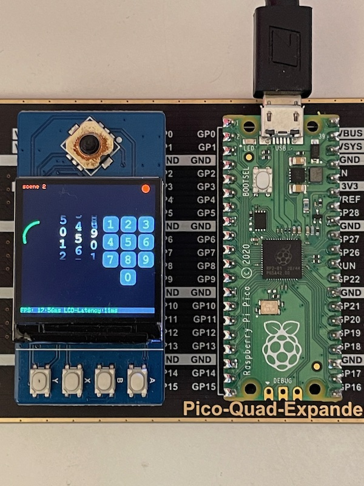

# README

Adaptation layer for using Arm2D on RP2040.



To get started you'll need:

* The Pico RP 2040 SDK and pico-examples ready to be used. If you can build some examples then you can use this project
* A ST7789 serial LCD. 
* Arm libraries:
  * [CMSIS-DSP](https://github.com/ARM-software/CMSIS-DSP)
  * [CMSIS_5](https://github.com/ARM-software/CMSIS_5)
  * [Arm-2D](https://github.com/ARM-software/Arm-2D)

Use the develop branch of Arm-2D since the CMake support has not yet been fully merged to the main branch.

The PINs used by the LCD are defined in:

`RP2040/st7789_lcd.c` 

You can change the definitions if the LCD is connected differently.

The LCD PIO driver and code are from the Raspberry Pi pico-examples and covered by the LICENSE file in RP2040 (copied to this project).

The file `RP2040/rp2040_hw_acceleration.c` shows how some Arm-2D functions can be accelerated (here by using the Pico hardware interpolator). More Arm-2D functions could benefit from the HW interpolator.

# To build

```shell
mkdir build.tmp
cd build.tmp

cmake -DARM2D=/ArmSoftware/Arm-2D \
 -DCMSISCORE=/ArmSoftware/CMSIS_5/CMSIS/Core \
 -DCMSIS-DSP=/ArmSoftware/CMSIS-DSP \
 -DARM2D_RP2040=/ArmSoftware/Arm2D_RP2040/RP2040 \
 ../Demo

make
```